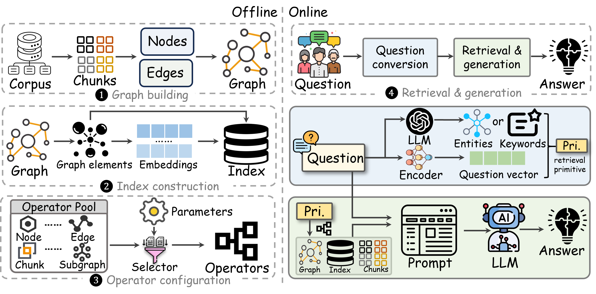

## Credits

This project is a fork of [JayLZhou/GraphRAG](https://github.com/JayLZhou/GraphRAG).
All credit for the original design and implementation goes to the original authors.

### About this Fork: DIGIMON

This fork, **DIGIMON (Deep Analysis of Graph-Based Retrieval-Augmented Generation Systems)**, significantly refactors and extends the original project. The primary motivation is to transform the initial monolithic testing pipeline into a highly modular and flexible "usage suite." This allows for deeper analysis, more adaptable experimentation, and provides a robust foundation for advanced research into graph-based RAG.

Key enhancements in this fork include:
* **Decoupled Operational Modes:** You can now separately format documents, build Knowledge Graphs (KGs) and their associated vector databases, query these artifacts, and evaluate the results.
* **Focus on Granular Operators:** The system exposes approximately 16 underlying retrieval and graph manipulation operators, paving the way for dynamic composition of RAG strategies.
* **Intelligent Agent Development:** A major goal of this fork is the development of an LLM-based intelligent agent capable of autonomously structuring KGs and dynamically determining optimal retrieval chains by leveraging these granular operators.

## 👾 DIGIMON: Deep Analysis of Graph-Based Retrieval-Augmented Generation (RAG) Systems

<div style="text-align: center;">
  <a href="https://github.com/BrianMills2718/Digimon_KG"></a>
  <a href="https://github.com/JayLZhou/GraphRAG"></a>
  <a href="https://github.com/JayLZhou/GraphRAG"></a>
  <a href="https://github.com/JayLZhou/GraphRAG"></a>
</div>

> **GraphRAG** is a popular 🔥🔥🔥 and powerful 💪💪💪 RAG system! 🚀💡 Inspired by systems like Microsoft's, graph-based RAG is unlocking endless possibilities in AI.

> The DIGIMON project focuses on **modularizing and decoupling** these methods 🧩 to **unveil the mystery** 🕵️‍♂️🔍✨ behind them, enable advanced analysis, and develop intelligent agent-driven RAG. Our project🔨 is included in [Awesome Graph-based RAG](https://github.com/DEEP-PolyU/Awesome-GraphRAG).



---
[](https://www.arxiv.org/abs/2503.04338)
[](https://pypi.org/project/agentscope/)
[](https://modelscope.github.io/agentscope/tutorial/contribute.html) - If you find the original work or this fork helpful, please kindly cite [the original GraphRAG paper](https://www.arxiv.org/abs/2503.04338).
- Download the datasets referenced by the original paper: [GraphRAG-dataset](https://drive.google.com/file/d/14nYYw-3FutumQnSRwKavIbG3LRSmIzDX/view?usp=sharing)

---

## Project Goals (DIGIMON Fork)

* Provide a robust and modular framework for building, querying, and evaluating diverse graph-based RAG systems.
* Enable detailed analysis of individual components and operator chains within graph RAG pipelines.
* Develop an intelligent LLM-based agent capable of:
    * Autonomously structuring KGs (e.g., selecting graph types, applying ontologies).
    * Dynamically determining and executing optimal retrieval strategies by composing sequences of the system's granular operators.
* Serve as a flexible platform for research into advanced RAG techniques and agentic information retrieval.
* *(Optional: Add any other specific goals you have, e.g., related to your PhD research on social media discourse analysis, if you wish to make that public).*

---

## Current Features & Capabilities

### Decoupled Architecture

This fork features a modular design with three distinct operational modes, manageable via `main.py`:

1.  **Build Mode**: Constructs the knowledge graph and generates all necessary artifacts (e.g., graph structure, vector databases for entities/relations, community reports).
    ```bash
    python main.py build -opt Option/Method/RAPTOR.yaml -dataset_name your_dataset
    ```
2.  **Query Mode**: Loads pre-built artifacts to efficiently answer questions using a specified RAG method or operator chain.
    ```bash
    python main.py query -opt Option/Method/RAPTOR.yaml -dataset_name your_dataset -question "Your question here?"
    ```
3.  **Evaluate Mode**: Assesses the performance of different methods against benchmark datasets and questions.
    ```bash
    python main.py evaluate -opt Option/Method/RAPTOR.yaml -dataset_name your_dataset
    ```

### Web Interface (API & UI)

This fork also includes a Flask API server and an initial React UI for a user-friendly experience (Note: current development focus is more on backend agent capabilities):

#### Start the Flask API Server
```bash
# From the repository root
python api.py
This starts the server (default: http://localhost:5000), providing endpoints for /api/query, /api/build, and /api/evaluate.

Start the React UI
Bash

# From the repository root (if UI files are at root, or adjust path)
# cd graphrag-react-ui # If UI is in a subdirectory
npm install   # Only needed first time
npm start
Access the UI (default: http://localhost:3000).

Available Methods (Pre-defined Configurations)
The following pre-defined RAG method configurations have been verified to work with the decoupled build, query, and (for many) evaluate modes. These methods are compositions of the underlying granular operators.

Dalk (Entity-Relation graph)
GR (G-Retriever, Entity-Relation graph)
LGraphRAG (Local search in GraphRAG, uses RKG with communities)
GGraphRAG (Global search in GraphRAG, uses RKG with communities)
HippoRAG (Entity-Relation graph)
KGP (Passage graph)
LightRAG (Rich knowledge graph)
RAPTOR (Tree graph)
ToG (Think-on-Graph, Entity-Relation graph)
Intelligent Agent Framework (Under Development)
A core focus of this fork is building an intelligent agent that can dynamically compose RAG strategies.

Operator-Level Modularity: The agent will leverage the ~16 granular operators (detailed below) as its building blocks or "tools."
Pydantic-based Execution Plans: The agent's reasoning will result in a structured "Execution Plan" (defined using Pydantic models) that specifies the sequence of operators and their configurations.
Agent Orchestrator: A backend component is being developed to interpret these plans and execute the tool chain.
Current Tool Progress: The Entity.VDBSearch tool has been successfully implemented and tested end-to-end, including VDB persistence and loading.
Quick Start 🚀
From Source
Bash

# Clone this repository
git clone [https://github.com/BrianMills2718/Digimon_KG.git](https://github.com/BrianMills2718/Digimon_KG.git) # Ensure this is your repo URL
cd Digimon_KG
Install Dependencies
Ensure you have the required dependencies installed. The primary environment is defined in experiment.yml.

Bash

conda env create -f experiment.yml -n digimon
conda activate digimon
(Note: environment.yml may also be present; experiment.yml is referenced in the original quick start).

API Keys and Configuration
Copy Option/Config2.example.yaml to Option/Config2.yaml.
Edit Option/Config2.yaml to include your API keys (e.g., OpenAI) and set desired default models.
Method-specific configurations are in Option/Method/.
Supported LLM Backends
DIGIMON supports both cloud-based and local deployment of LLMs via Option/Config2.yaml:

Cloud-based models: OpenAI (e.g., gpt-4, gpt-3.5-turbo)
Locally deployed models: Ollama and LlamaFactory compatible endpoints.
To use a local model, set api_type to open_llm in Option/Config2.yaml and provide your local model's base_url and model name.

Example Option/Config2.yaml snippet for LLM:
YAML

llm:
  # For OpenAI
  api_type: "openai"
  model: "gpt-3.5-turbo"
  # api_key: "YOUR_OPENAI_API_KEY" # Can also be set as an environment variable

  # For Ollama or other LlamaFactory-compatible local LLMs
  # api_type: "open_llm"
  # model: "YOUR_LOCAL_MODEL_NAME" # e.g., "llama3"
  # base_url: "http://localhost:11434/v1" # Default for Ollama OpenAI-compatible API
  # api_key: "unused" # Typically not required for local models
Representative Methods (Original GraphRAG Context)
The original GraphRAG project implemented and analyzed several representative Graph RAG methods:

Method	Description	Link	Graph Type
RAPTOR	ICLR 2024		Tree
KGP	AAAI 2024		Passage Graph
DALK	EMNLP 2024		KG
HippoRAG	NIPS 2024		KG
G-retriever	NIPS 2024		KG
ToG	ICLR 2024		KG
MS GraphRAG	Microsoft Project		TKG
FastGraphRAG	CircleMind Project		TKG
LightRAG	High Star Project		RKG

Export to Sheets
Graph Types
(This section from the original README is excellent and relevant – keeping it as is)

Based on the entity and relation, we categorize the graph into the following types:

Chunk Tree: A tree structure formed by document content and summary.
Passage Graph: A relational network composed of passages, tables, and other elements within documents.
KG: knowledge graph (KG) is constructed by extracting entities and relationships from each chunk, which contains only entities and relations, is commonly represented as triples.
TKG: A textual knowledge graph (TKG) is a specialized KG (following the same construction step as KG), which enriches entities with detailed descriptions and type information.
RKG: A rich knowledge graph (RKG), which further incorporates keywords associated with relations.
The criteria for the classification of graph types are as follows:

Graph Attributes	Chunk Tree	Passage Graph	KG	TKG	RKG
Original Content	✅	✅	❌	❌	❌
Entity Name	❌	❌	✅	✅	✅
Entity Type	❌	❌	❌	✅	✅
Entity Description	❌	❌	❌	✅	✅
Relation Name	❌	❌	✅	❌	✅
Relation keyword	❌	❌	❌	❌	✅
Relation Description	❌	❌	❌	✅	✅
Edge Weight	❌	❌	✅	✅	✅

Export to Sheets
Operators in the Retrieve Stage (Building Blocks for the DIGIMON Agent)
The retrieval stage lies the key role ‼️ in the entire GraphRAG process. ✨ The goal is to identify query-relevant content that supports the generation phase, enabling the LLM to provide more accurate responses.

💡💡💡 After thoroughly reviewing all implementations, we've distilled them into a set of 16 operators 🧩🧩. Each pre-defined method constructs its retrieval module by combining one or more of these operators. The DIGIMON agent will dynamically chain these operators to create novel and optimized RAG strategies.

Five Types of Operators
We classify the operators into five categories, each offering a different way to retrieve and structure relevant information from graph-based data.

⭕️ Entity Operators
Retrieve entities (e.g., people, places, organizations) that are most relevant to the given query.

Name	Description	Example Methods
VDB	Select top-k nodes from the vector database	G-retriever, RAPTOR, KGP
RelNode	Extract nodes from given relationships	LightRAG
PPR	Run PPR on the graph, return top-k nodes with PPR scores	FastGraphRAG
Agent	Utilizes LLM to find the useful entities	ToG
Onehop	Selects the one-hop neighbor entities of the given entities	LightRAG
Link	Return top-1 similar entity for each given entity	HippoRAG
TF-IDF	Rank entities based on the TF-IFG matrix	KGP

Export to Sheets
➡️ Relationship Operators
Extracting useful relationships for the given query.

Name	Description	Example Methods
VDB	Retrieve relationships by vector-database	LightRAG、G-retriever
Onehop	Selects relationships linked by one-hop neighbors of the given selected entities	Local Search for MS GraphRAG
Aggregator	Compute relationship scores from entity PPR matrix, return top-k	FastGraphRAG
Agent	Utilizes LLM to find the useful entities	ToG

Export to Sheets
📄 Chunk Operators
Retrieve the most relevant text segments (chunks) related to the query.

Name	Description	Example Methods
Aggregator	Use the relationship scores and the relationship-chunk interactions to select the top-k chunks	HippoRAG
FromRel	Return chunks containing given relationships	LightRAG
Occurrence	Rank top-k chunks based on occurrence of both entities in relationships	Local Search for MS GraphRAG

Export to Sheets
📈 Subgraph Operators
Extract a relevant subgraph for the given query

Name	Description	Example Methods
KhopPath	Find k-hop paths with start and endpoints in the given entity set	DALK
Steiner	Compute Steiner tree based on given entities and relationships	G-retriever
AgentPath	Identify the most relevant 𝑘-hop paths to a given question, by using LLM to filter out the irrelevant paths	TOG

Export to Sheets
🔗 Community Operators
Identify high-level information, which is only used for MS GraphRAG.

Name	Description	Example Methods
Entity	Detects communities containing specified entities	Local Search for MS GraphRAG
Layer	Returns all communities below a required layer	Global Search for MS GraphRAG

Export to Sheets
You can freely 🪽 combine those operators 🧩 to create more and more GraphRAG methods, which is a core goal for the DIGIMON agent.

🌰 Examples (How Pre-defined Methods Use Operators)
Below, we present some examples illustrating how existing algorithms leverage these operators.

Name	Operators
HippoRAG	Chunk (Aggregator)
LightRAG	Chunk (FromRel) + Entity (RelNode) + Relationship (VDB)
FastGraphRAG	Chunk (Aggregator) + Entity (PPR) + Relationship (Aggregator)

Export to Sheets
🎯 Future Plans for DIGIMON
This section outlines the specific future development goals for this DIGIMON fork:

[ ] Tool Implementation: Fully implement and rigorously test all ~16 granular tool interface functions (Core/AgentTools/) for robust agent use.
[ ] Agent Orchestrator: Develop the "Agent Orchestrator" component responsible for parsing LLM-generated ExecutionPlan Pydantic models and invoking the tool functions in sequence, managing data flow between them.
[ ] LLM Agent Core: Design and implement the core LLM-based agent, including:
Prompt engineering strategies to enable the LLM to generate optimal ExecutionPlans based on user queries/goals and knowledge of the available tools.
Integration with LLM provider libraries (e.g., LiteLLM, PydanticAI) for flexibility and structured output.
[ ] Ontology Management: Enhance agent capabilities for intelligent ontology selection/definition based on task requirements, potentially integrating with Config/custom_ontology.json.
[ ] Advanced KG & Retrieval Strategies: Explore and implement more sophisticated graph construction and retrieval techniques that can be leveraged by the agent (e.g., temporal KGs, advanced pathfinding, subgraph reasoning).
[ ] Evaluation Framework for Agent Strategies: Develop methods to evaluate the effectiveness and efficiency of RAG strategies dynamically composed by the agent.
[ ] User Interface for Agent Interaction: (Optional/Long-term) Design a UI that allows users to interact with the intelligent agent, define high-level tasks, and inspect the agent's plans and results.
[ ] Documentation & Examples: Provide comprehensive documentation for the agent framework, tool contracts, and examples of how to use the DIGIMON system for advanced RAG analysis and agent-driven querying.
[ ] Dockerization: Create a Docker image for easier deployment and reproducibility of the DIGIMON environment, including the agent capabilities.
[ ] (Add any other specific plans you have for DIGIMON here)
🧭 Cite The Original GraphRAG Paper
If you find this work useful, please consider citing the original paper that inspired this project:

In-depth Analysis of Graph-based RAG in a Unified Framework
@article{zhou2025depth,
  title={In-depth Analysis of Graph-based RAG in a Unified Framework},
  author={Zhou, Yingli and Su, Yaodong and Sun, Youran and Wang, Shu and Wang, Taotao and He, Runyuan and Zhang, Yongwei and Liang, Sicong and Liu, Xilin and Ma, Yuchi and others},
  journal={arXiv preprint arXiv:2503.04338},
  year={2025}
}